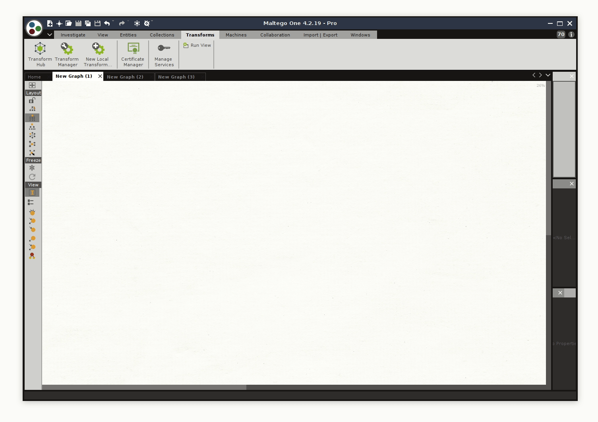
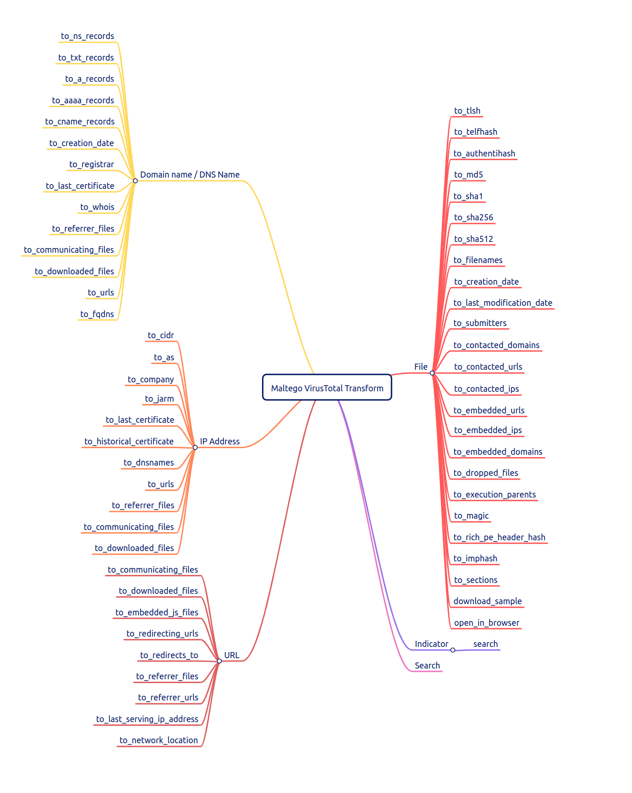
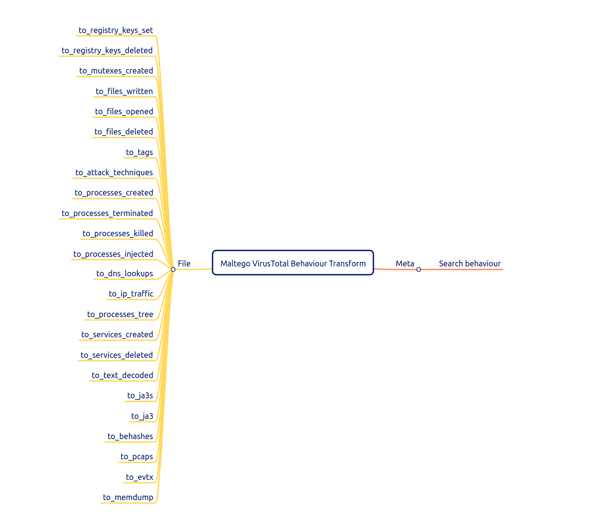

# SEKOIA.IO Maltego Transforms

Welcome to the Sekoia Maltego Transform repository!

To help the Threat Intelligence community we decided to share at this place some of our home-cooked Maltego transforms that we use on a daily basis for our APT & Cybercrime investigations. Feel free to open Pull Requests if you want to add/change something to the transforms or ask questions via the Issues or directly by email at `tdr@sekoia.io`.

## Install the dependencies

Clone the repository and install the Python dependencies
```
git clone <url to change>
python3 -m pip install -r requirements.txt
```
## Importing local transforms

The local Maltego transforms can be imported in few quick steps. First, you need to import the transforms on your hard drive by moving the `config.yaml` file, `libs` directory and the `*.py` in your own transform directory. If you don't have your own local transform directory, you can create one anywhere, you will be able change the transforms working path inside Maltego. Once everything is moved, you need to import the `export.mtz` file select what you want to import, if you want to enjoy the full set, just import all the stuff!

This will import new objects / transforms / set in Maltego. But in order to get the transforms working, you need to set their working directory to point out where they are present on your hardrive. Here is how to do it in few clicks:



Then edit the `config.yaml` file with your API keys and you're ready to play with it!

## Shared transforms

### VirusTotal - virustotal.py
The VirusTotal transform allows you to explore the VT database via Maltego easily. With this transform you can pivot from codes to infrastructure, and vice versa. It also implements a meta search entity which allows you to search directly on VTI from Maltego and then, pivot on the results. Here is a mind-map of the transforms implemented for each entities.




### VirusTotal Behaviour - virustotal-behaviour.py
The VirusTotal Behaviour transform deals with behaviour stuff related to file objects. You can retreive many stuff such as pcaps, evtx and much more! Moreover, you can also pivot easily on behaviours. Here is a mind-map of the transforms implemented for each entities.



### Open With - openwith.py
This is just a little transform which allows you to open a downloaded file in your favourite text/hex editor or disassembler. You can edit the executable paths from the `config.yaml` configuration file.


## Contact
Twitter: https://twitter.com/SEKOIA_IO
Email: tdr@sekoia.io
